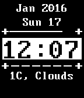

# InR-DOS

  

[Pebble](https://getpebble.com) Watchface created using Pebble Developer [Tutorials](https://developer.getpebble.com/tutorials/)

[Import into CloudPebble](https://cloudpebble.net/ide/import/github/idiotandrobot/inr-dos/)
